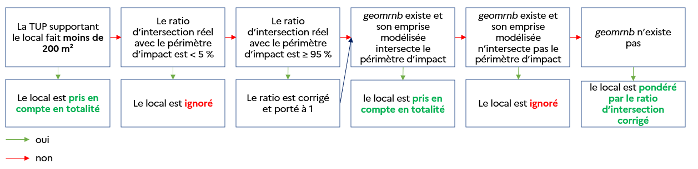
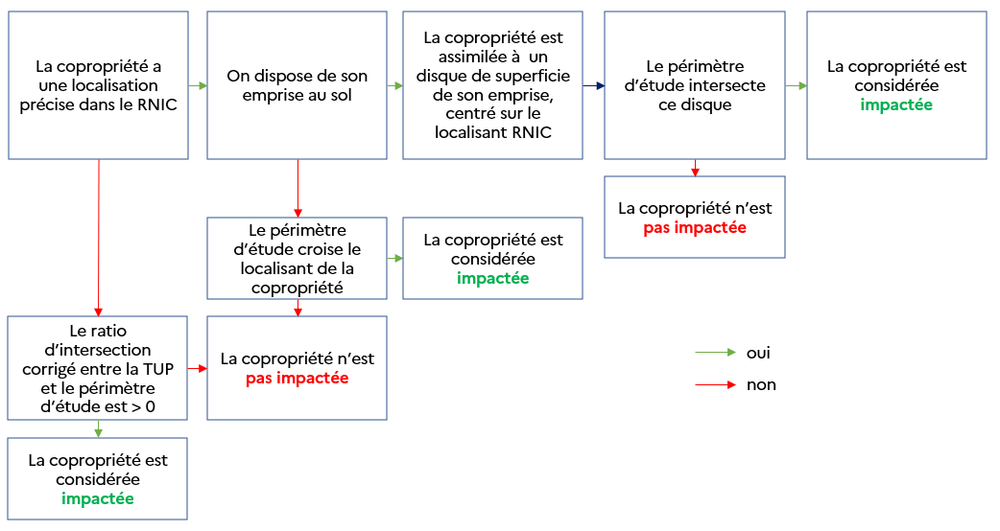

# Méthodologie

## Gestion du périmètre d'étude

### Re-projection préalable et subdivision

Le périmètre d'étude est d'abord reprojeté en EPSG 4326 (coordonnées GPS) pour prendre en compte un traitement potentiel à l'échelle nationale qui inclurait les DROM, ou pour redresser tout EPSG exotique.  
Il est ensuite subdivisé et re-projeté en système local, en fonction de la zone, pour la France hexagonale et les DROM. Les systèmes utilisés sont ceux disponibles dans les Fichiers fonciers et DV3F. Les calculs d'indicateurs qui mobilisent des surfaces nécessitent impérativement des coordonnées locales : cette opération est donc indispensable.

### Détermination des communes, EPCI et départements concernés

La routine calcule systématiquement propose des résultats agrégés aux communes, EPCI et départements dits "concernés" par le périmètre d'étude.

Le périmètre subdivisé et reprojeté est utilisé pour déterminer les entités administratives qui seront considérées "concernées" lors du traitement : ce sont les références qui apparaîtront systématiquement dans les tableaux de résultats finaux. Pour réaliser cette opération en limitant les frictions potentielles de codes géographiques entre l'INSEE et les bases de données d'origine fiscale, c'est le référentiel des communes proposé par Fichiers fonciers qui est choisi (table agrégée ``commune``). De façon similaire, ce sont les départements de cette même base qui sont choisis comme référence de départements concernés (table agrégée `departement`).  
Enfin, la détermination des EPCI ne peut pas être faite en utilisant les Fichiers fonciers, qui n'intègre pas de référentiel des intercommunalités. C'est donc la base ADMIN EXPRESS de l'IGN qui est mobilisée, en cohérence avec le millésime des Fichiers fonciers.  

Les hypothèses suivantes sont retenues pour considérer qu'une entité administrative est "concernée" :

* seules les communes intersectées au moins 1 000 m² par le périmètre d'étude sont retenues,
* seuls les EPCI intersectés à au moins 1 000 m² par le périmètre d'étude sont retenus,
* seuls les départements contenant au moins une commune concernée sont retenus.

L'avantage des méthodes d'agrégation à la commune et au département est qu'il est possible de procéder au calcul des résultats par jointure sémantique (c'est-à-dire en reliant des codes géographiques) plutôt que par jointure géographique : le traitement est beaucoup plus rapide.

> ❗ **Bon à savoir : cohérence entre les échelles d'agrégation**  
> La production des indicateurs nécessite d'effectuer des arrondis à l'entier supérieur pour obtenir des résultats viables (il paraît peu pertinent d'indiquer qu'on impact 2,31 locaux). Ainsi, il est normal d'identifier de légers décalages en sommant les résultats à la commune et à l'ensemble du périmètre, par exemple. Une conséquence directe est donc que plus l'échelle d'agrégation est segmentée en petits éléments, plus une surestimation est induite.  
> De plus, des petites différences géométriques peuvent modifier les résultats en fonction des échelles d'agrégation, par construction des Fichiers fonciers : les contours des départements et des communes ne sont pas équivalents à l'union des parcelles qui les constitue.

### Cas particulier des échelles d'agrégation personnalisées

Si des échelles d'agrégation particulières sont passées pour regrouper les indicateurs (par exemple : zonages SLGITC), c'est un croisement géographique qui est effectué. Pour pallier les problématiques d'intersection sur plusieurs entités, par exemple avec des mutations, la méthode utilisée est la même dans l'ensemble de la routine. À chaque fois, la mutation est attribuée à l'entité géographique d'agrégation **avec laquelle elle partage la plus grande intersection**.

## Indicateurs des marchés fonciers et immobiliers

### Mutations retenues

Pour simplifier les opérations, seules les mutations situées sur une seule commune (`nbcomm = 1`) sont considérées.  
Une jointure géographique est ensuite faite avec le périmètre d'étude et la couche des communes concernées pour ne conserver que les mutations qui sont dans le périmètre d'étude et attribuer un code commune à jour à l'année d'observation du stock.

Dans le cas de l'exsitence d'artefacts géométriques (par exemple, une parcelle dépasse du périmètre communal), on attribue la mutation à la commune qui a la plus grande intersection avec la géométrie des parcelles affectées par la mutation. Une suppression d'éventuels doublons est également effectuée.

#### Cas particulier des locaux ayant mutés plusieurs fois

Pour repérer les locaux qui ont muté plusieurs fois, une couche de filtre supplémentaire est appliquée. En particulier, on ne conserve que les mutations non particulières (`filtre='0'`) qui ont fait l'objet de la mutation d'un unique local (``nblocmut=1``) afin de suivre l'évolution du prix du local dans le temps. Les locaux de type dépendances ne sont pas conservées.

#### Cas particulier de l'activité du marché

Dans le cas du calcul de l'indicateur d'activité du marché, des filtres spécifiques sont mis en place.  
En particulier, les logements neufs et VEFA ne sont pas considérés car ces-derniers font le plus souvent l'objet d'une transaction lors de leur apparition dans le parc. Cette précaution permet de ne pas transformer l'indicateur d'activité en indicateur de construction neuve. Le parc social est également écarté car nous considérons que la vente de logements sociaux est plus liée à des choix politiques locaux qu'à une logique de marché.  

La méthodologie utilisée ici s'appuie sur celle bâtie dans le cadre du calcul de l'indicateur à l'échelle nationale. Elle est explicitée en détail sur [la documentation Datafoncier dédiée](https://doc-datafoncier.cerema.fr/doc/guide/dv3f/activite-du-marche-ou-rotation-des-proprietaires).

### Indicateurs de prix et de volumes

Les indicateurs de prix et de volumes ne tiennent pas tous compte des mêmes mutations.  

La totalité des mutations retenues est conservée pour déterminer le nombre de mutations (``nb_mutations``), la valeur totale des mutations (``valeurfonc_totale``) et la surface totale de terrains ayant muté (``surface_totale``). C'est également le cas des indicateurs `nb_mutations` et `surface_totale_foncier_nu`, en limitant aux mutations non bâties.

Les dénombrements de transactions par type de bien tiennent compte uniquement des biens ne faisant pas l'objet de mutations particulières. Le calcul du nombre de transactions de maisons (``nbtrans_maisons``), d'appartements (``nbtrans_appts``), de locaux d'activité (``nbtrans_act``) et d'activité tertiaire (``nbtrans_act_tertiaire``) se restreint aux mutations obéissant aux conditions suivantes : ``filtre = '0' AND (devenir = 'S' or devenir = 'M')``. La même hypothèse est appliquée pour déterminer le nombre de locaux ayant mutés, par type de bien (`nblocmut_xxx`).

Afin de garantir un calcul de prix médian fiable sur le bâti, une condition supplémentaire est appliquée pour `px_med_maison` et `px_med_appt` : on ne considère que les mutations d'un seul bien.

Pour les indicateurs concernant le foncier nu avec distinction sur les terrains à bâtir (TAB), les mutations non particulières ont été conservées (`filtre = '0'`). L'hypothèse suivante a été appliquée pour distinguer les cas :

* les terrains à bâtir sont ceux pour lesquels l'indicateur de repérage des TAB a une fiabilité excellente ou très bonne (`segmtab IN (3, 4)`),
* les autres sont ceux pour lequels l'indicateur de repérage des TAB n'est pas renseigné (`segmtab IS NULL`) : fiabilité moindre que relative.

#### Évolution des prix

Les indicateurs d'évolution des prix s'appuient sur les indicateurs décrits précédemment. Afin d'assurer une comparaison homogène, les prix sont ramenés en € de la période d'étude la plus récente.   
Comme les périodes d'études s'étalent sur trois ans, un choix arbitraire a été fait : les prix sont convertis en € de l'année du milieu de la période. Ainsi, pour une période d'étude la plus récente de 2022 - 2024, toutes les mutations sont ramenées en €2023.

### Indicateurs d'activité du marché

Nous invitons le lecteur à prendre connaissance de [la documentation Datafoncier dédiée](https://doc-datafoncier.cerema.fr/doc/guide/dv3f/activite-du-marche-ou-rotation-des-proprietaires) : la méthodologie mise en œuvre ici est identique.

> ⚠️ **Remarque importante sur l'indicateur d'évolution de l'activité** : comme la base de données DV3F présente des décalages dans l'apparition des mutations dans la base, les données obtenues pour la dernière année à la date du millésime sont incomplètes. Dans le cas de l'activité du marché, il a semblé plus adapté **d'établir une comparaison d'activité entre la première période d'étude et l'avant-dernière**, de façon à limiter des interprétations de baisse d'activité qui seraient simplement liées à un recensement non exhaustif des mutations ayant vraiment eu lieu.

### Top acheteurs/vendeurs

Ces indicateurs présentent les catégories d'acheteurs ou de vendeurs les plus représentées pour chaque unité de chaque échelle d'agrégation. Un classement des 5 catégories est établi en tenant compte de la somme des valeurs foncières pour chaque période d'étude. Ainsi, une catégorie peut avoir un nombre d'occurences faible mais un classement important si les montants des ventes sont particulièrement importants (par exemple, un professionnel de l'immobilier ou un bailleur qui réalisé un achat important sur une même mutation).  
La mention "mixte" apparaît s'il s'agit de mutations pour lesquelles au moins deux catégories d'acheteurs/vendeurs est détectée.

### Locaux ayant mutés plusieurs fois

Les indicateurs sur les locaux ayant mutés plusieurs fois s'affranchissent des périodes d'étude et déterminent les locaux de type maison, appartement ou activité qui ont fait l'objet d'au moins deux mutations depuis 2010 (date de disponibilité de la donnée DV3F). Les évolutions de prix proposées (nominale ou en pourcentage), par rapport à la première mutation enregistrée ou à la précédente, tiennent toutes compte d'un redressement du montant de la mutation vers les €2024.

## Détermination des locaux et des parcelles dans le périmètre d'étude

La détermination des locaux, parcelles et [unités foncières (TUP)](https://doc-datafoncier.cerema.fr/doc/guide/ff/le-foncier-non-bati-parcelle-suf-unite-fonciere-tup#la-table-des-tup) dans le périmètre d'étude s'appuie sur une intersection géographique entre le périmètre d'étude et les données présentes dans les Fichiers fonciers. Il est difficile de dénombrer avec précision les locaux et les types de surfaces impactées en raison de la construction même de la base.  
La géométrie rattachée aux locaux (`geomloc`) est un simple localisant parcellaire (centroïde de la TUP ou point dans la TUP) qui n'est donc pas un indicateur de la véritable position d'un local sur une parcelle ou une TUP.  

C'est pourquoi il est nécessaire de trouver un moyen de dénombrer les locaux sans induire de sur-estimation ou de sous-estimation dans la méthodologie. Par exemple, un dénombrement brut des locaux situés sur une parcelle qui contiendrait une vingtaine de locaux mais qui n'est intersectée qu'à 10 % par le périmètre d'étude induirait une forte sur-estimation.  

Nous avons ainsi mis en place **un système de ratio d'intersection**.

> 💡 **Remarque** : pour faciliter la compréhension de cet aspect méthodologique, le Cerema Hauts-de-France a produit une courte présentation sous forme de pdf avec des schémas illustrant les différentes situations qu'il est possible de rencontrer.

Pour chaque TUP, on détermine la superficie de l'intersection entre la TUP et le périmètre d'étude. Puis on calcule un ratio d'intersection `r` défini comme la superficie de l'intersection divisée par la superficie de la TUP.  
Par construction, il est donc borné entre 0 et 1. Il est ensuite ajusté de la façon suivante :

- si la TUP a une superficie strictement inférieure à 200 m², `r = 1` (on considère que la TUP est suffisamment petite pour que la moindre intersection avec le périmètre d'impact soit significatif),
- si la TUP a une superficie supérieure ou égale à 200 m² mais que le ratio d'intersection est inférieur à 5 %, `r = 0`, de façon à limiter les artefacts géométriques,
- si la TUP a une superficie supérieure ou égale à 200 m² et que le ratio d'intersection est supérieur ou égal à 95 %, `r = 1`,
- sinon, `r` conserve sa valeur initiale.

L'identification des locaux situés dans le périmètre d'étude s'effectue ensuite en récupérant tous les locaux situés sur chaque TUP puis en s'appuyant sur [le rapatriement du RNB dans les Fichiers fonciers](https://doc-datafoncier.cerema.fr/doc/guide/ff/integration-du-referentiel-national-des-batiments) (disponible depuis le millésime 2024), qui permet de localiser plus précisément le local sur sa TUP, lorsque l'information est disponible.  
Il y a alors deux possibilités :

1. si le local dispose d'une `geomrnb` non NULL, on le compte alors au "réel" : on assimile le bâtiment à un disque de superficie égale à `rnb_emp` et de centre `geomrnb` et on l’intersecte à la zone d’étude,
2. si le local a une `geomrnb` NULL : on le pondère avec le ratio d'intersection ajusté de sa TUP de rattachement, calculé ci-avant.

Le logigramme suivant représente la cinématique de comptage des locaux.

## Indicateurs de stock (locaux, surfaces)

La méthodologie de prise en compte des locaux et des parcelles est détaillée dans la partie ci-avant. Le calcul, par exemple, du nombre de maisons dans le périmètre d'étude revient donc à effectuer une somme des coefficients de prise en compte des locaux, plutôt que de les compter inclus dans le périmètre systématiquement.

### Précisions sur les locaux

La discrimination des locaux se fait à l'aide des variables ``dteloc`` (nature du local), ``jannath`` (année de construction redressée), ``stoth `` (surface d'habitation), ``typeloc`` (statut et mode d'occupation) et ``typact`` (nature de l'activité pour les locaux d'activité).  
Les notions présentées ici peuvent être approfondies en prenant connaissance de [la documentation de la table des locaux des Fichiers fonciers](https://doc-datafoncier.cerema.fr/doc/ff/pb0010_local).  
On précise que, dans le cas des locaux d'activité tertiaire, la surface calculée correspond à la somme de la surface principale (surfaces essentielles à l'activité du local) et de la surface secondaire (potentiel commercial plus faible, comme les espaces techniques ou de stockage) renseignées dans la base.

### Précisions sur les surfaces NAF et urbanisées

Un calcul de la superficie des surfaces de type NAF et urbanisées dans le périmètre d'étude est proposé. Nous rappelons que seules les surfaces cadastrées sont comptées. Il est donc normal de trouver des différences entre la surface totale de l'unité d'agrégation comprise dans le périmètre d'étude et la somme des surfaces NAF et urbanisées fournies ici.  

De plus, les modes de calcul sont très importants : il convient de bien distinguer [la surface géométrique et le reste](https://doc-datafoncier.cerema.fr/doc/guide/ff/dcntpa-surface-de-la-parcelle#differences-entre-la-surface-dcntpa-et-la-surface-geometrique). Enfin, il arrive que des parcelles qui contiennent une majeure partie de mer aient une surface fiscale bien inférieure à la surface géométrique réelle.

### Précisions sur les surfaces de zones d'activités économiques

Les surfaces présentées sont la somme des surfaces des zones d'activités économiques comprises dans le périmètre d'étude pour l'unité d'agrégation considérée. Ces surfaces sont calculées à partir de l'inventaire des zones d'activités économiques de la Région Hauts-de-France.

### Précisions sur les surfaces de parcelles bâties avec usages dominant

Les variables ``sparbat_hab``, ``sparbat_act``, ``sparbat_mixte`` font l'objet d'un traitement particulier. Seules les parcelles dont le coefficient ajusté est strictement supérieur à 0 sont considérées. Cela signifie que les parcelles prises en compte pour le calcul de ces indicateurs sont :
* soit celles dont la superficie est inférieure à 200 m² et intersectée par le périmètre d'étude,
* soit celles dont la superficie est supérieure à 200 m² et intersectées à au moins 5 % par le périmètre d'étude.

La détermination de l'usage dominant s'appuie sur la variable ``tlocdomin``. Les regroupements ont été effectués comme suit :
* habitat : ``tlocdomin IN ('MAISON', 'APPARTEMENT', 'DEPENDANCE')``,
* activité : ``tlocdomin = 'ACTIVITE (COMMERCIAL)'``,
* mixte : ``tlocdomin = 'MIXTE'``.

Il est important de noter que les surfaces affichées concernent à la somme des surfaces réelles des parcelles, pas celles de leur itnersection avec le périmètre d'étude.

### Détermination des TUPs appartenant à des multipropriétaires

Cinq indicateurs sur les [unités foncières (TUP)](https://doc-datafoncier.cerema.fr/doc/guide/ff/le-foncier-non-bati-parcelle-suf-unite-fonciere-tup#la-table-des-tup) **bâties** sont présentés pour contextualiser la multipropriété dans le périmètre d'étude. Le lecteur est invité à prendre connaissance de [la documentation des Fichiers fonciers dédiée aux droits de propriété](https://doc-datafoncier.cerema.fr/doc/guide/ff/definitions-liees-au-proprietaire).  
Le but est de déterminer quelles TUPs dans le périmètre d'étude appartiennent à des multipropriétaires. Pour cela, une jointure est effectuée entre l'``idprocpte`` (identifiant de compte propriétaire) de la TUP et l'``idpersonne``, un identifiant départemental de propriétaire, à l'aide de la table ``proprietaire_droit``. Dans les cas où plusieurs comptes propriétaires existent pour une même TUP, cette jointure est faite autant de fois qu'il y a de comptes propriétaires, dans la limite du nombre affiché dans les Fichiers fonciers. L'association de l'``idpersonne`` à la TUP permet ensuite de déterminer si le propriétaire possède d'autres TUP dans le périmètre d'impact ou ailleurs dans le département.  

Pour ces indicateurs, les dénombrements sont faits **sans application de la méthode du ratio d'intersection**. Cependant, ce-dernier a été pris en compte pour qualifier les TUP comme étant "dans le périmètre d'étude" : elles doivent être intersectées à au moins 5 % de leur surface. Chaque TUP a été jointe à son unité d'agrégation par jointure sémantique dans le cas d'une agrégation à l'échelle communale ou départementale, ou par jointure géographique sinon. On a les correspondances suivantes :

* ``nb_tup`` : nombre de TUP dans le périmètre d'étude dans l'unité d'agrégation considérée,
* ``nb_tup_multiple_in_perimetre`` : nombre de TUP dans le périmètre d'étude dont le ou un des propriétaires possède également une autre TUP dans le périmètre d'étude,
* ``surface_multiple_in_perimetre`` : somme des surfaces des TUP dans l'unité d'agrégation dont le ou un des propriétaires possède également une autre TUP dans le périmètre d'étude,
* ``nb_tup_multiple_any`` : nombre de TUP dans le périmètre d'étude dont le ou un des propriétaires possède également une autre TUP dans le même département,
* ``surface_multiple_any`` : somme des surfaces des TUP dans l'unité d'agrégation dont le ou un des propriétaires possède également une autre TUP dans le même département.

Par construction de ces indicateurs, les surfaces indiquées tiennent compte de la totalité des surfaces des TUP, sans intersection avec le périmètre d'étude.

### Détermination des copropriétés

La base de données CoproFF, issue du croisement du RNIC et des Fichiers fonciers, a été utilisée pour déterminer les copropriétés intersectées par le périmètre d'éutde. Cette base propose plusieurs géométries pour les copropriétés. En fonction des situations, des méthodologies différentes ont été appliquées pour déterminer si la copropriété est considérée intersectée :
* si une copropriété est localisée par un point dans le RNIC (localisation "précise") et qu'on dispose que son emprise au sol (en m²), la copropriété est assimilée à un disque de superficie de son emprise, centré sur le localisant RNIC. La copropriété est alors considérée impactée si le périmètre d'étude croise ce disque,
* si une copropriété est localisée par un point dans le RNIC (localisation "précise") et qu'on ne dispose pas de son emprise au sol, la copropriété est considérée impactée si le périmètre d'étude croise le localisant de la copropriété,
* si une coproriété n'a pas de localisation précise et que seul un localisant de TUP est disponible, la copropriété est considérée intersectée si elle est située sur une TUP pour laquelle coeff_tup_ajuste > 0.

Les comptages sont ensuite ventilés dans différentes variables en fonction du nombre de lots dans la coproriété. Le nombre de lots des copropriétés qui ne sont pas immatriculées n'est pas disponible.

Le logigramme suivant représente la cinématique de comptage des locaux.

## Détermination des équipements

Les équipements comme les gares, les transformateurs électriques, les infrastructures de transport, les établissements publics... ont été déterminés par croisement géographique avec la BD TOPO, entre le périmètre d'étude et la géométrie de l'entité concernée dans la colonne `geometrie`. Les résultats ont été regroupés selon la logique suivante.  

| Catégorie 1                | Catégorie 2                                       | Regroupement              |
|----------------------------|---------------------------------------------------|---------------------------|
| Administratif ou militaire | Administration centrale de l'Etat                 | Autres ERP                |
| Administratif ou militaire | Autre Service Médico-Social                       | Autres ERP                |
| Administratif ou militaire | Centre De Formation                               | Autres ERP                |
| Administratif ou militaire | Divers public ou administratif                    | Autres ERP                |
| Administratif ou militaire | Mairie                                            | Autres ERP                |
| Administratif ou militaire | Palais de justice                                 | Autres ERP                |
| Administratif ou militaire | Poste                                             | Autres ERP                |
| Administratif ou militaire | Service Administratif                             | Autres ERP                |
| Administratif ou militaire | Service Administratif Du Domaine Fiscal           | Autres ERP                |
| Administratif ou militaire | Service Administratif Du Domaine Médico-Social    | Autres ERP                |
| Administratif ou militaire | Service D'Accueil Des Usagers                     | Autres ERP                |
| Administratif ou militaire | Service D'Administration Local                    | Autres ERP                |
| Administratif ou militaire | Service D'Aide Pour L'Emploi                      | Autres ERP                |
| Administratif ou militaire | Service Judiciaire Et D'Accueil Du Public         | Autres ERP                |
| Administratif ou militaire | Siège d'EPCI                                      | Autres ERP                |
| Administratif ou militaire | Sous-préfecture                                   | Autres ERP                |
| Administratif ou militaire | Tribunal                                          | Autres ERP                |
| Administratif ou militaire | Établissement Pénitentiaire                       | Autres ERP                |
| Culture et loisirs         | Bibliothèque et médiathèque                       | Autres ERP                |
| Culture et loisirs         | Conservatoire                                     | Autres ERP                |
| Culture et loisirs         | Musée                                             | Autres ERP                |
| Culture et loisirs         | Salle de spectacles                               | Autres ERP                |
| Petite enfance             | Crèche                                            | Autres ERP                |
| Sport                      | Complexe sportif couvert                          | Autres ERP                |
| Sport                      | Equipement sportif                                | Autres ERP                |
| Sport                      | Patinoire                                         | Autres ERP                |
| Sport                      | Piscine                                           | Autres ERP                |
| Science et enseignement    | Autre service de l'éducation                      | Enseignement              |
| Science et enseignement    | Collège                                           | Enseignement              |
| Science et enseignement    | Enseignement primaire                             | Enseignement              |
| Science et enseignement    | Enseignement supérieur                            | Enseignement              |
| Science et enseignement    | Lycée                                             | Enseignement              |
| Science et enseignement    | Structure d'accueil pour personnes handicapées    | Enseignement              |
| Science et enseignement    | Université                                        | Enseignement              |
| Gare                       | Gare fret uniquement                              | Gares                     |
| Gare                       | Gare voyageurs et fret                            | Gares                     |
| Gare                       | Gare voyageurs uniquement                         | Gares                     |
| Administratif ou militaire | Caserne                                           | Gestion de crise          |
| Administratif ou militaire | Caserne de pompiers                               | Gestion de crise          |
| Administratif ou militaire | Enceinte militaire                                | Gestion de crise          |
| Administratif ou militaire | Gendarmerie                                       | Gestion de crise          |
| Administratif ou militaire | Police                                            | Gestion de crise          |
| Gestion des eaux           | Station d'épuration                               | Infrastructures sensibles |
| Industriel et commercial   | Déchèterie                                        | Infrastructures sensibles |
| Production énergie         | Transformateur                                    | Infrastructures sensibles |
| Monument                   | Monument historique ou classé                     | Monuments historiques     |
| Santé                      | Etablissement de santé pour personnes handicapées | Santé                     |
| Santé                      | Etablissement et service de santé                 | Santé                     |
| Santé                      | Etablissement hospitalier                         | Santé                     |
| Santé                      | Hôpital                                           | Santé                     |
| Santé                      | Maison de retraite                                | Santé                     |

### Cas des ICPE

Les ICPE ont été récupérées en mai 2026 sur Georisques. Seule la première catégorie a été retenue : *les établissements soumis à autorisation ou enregistrement en exploitation avec titre et ceux pour lesquels nous avons des dates d'inspection antérieures à 2022, ou une inspection avec rapport après le 1er janvier 2022* (extrait de [Georisques](https://www.georisques.gouv.fr/risques/installations/donnees?page=1)).

## Détermination des surfaces AU intersectées

Les PLU et PLUi numérisés sont extraits du Géoportail de l'Urbanisme (version du 11/09/2024). Les cartes communales, qui peuvent parfois faire apparaître des zones dites constructibles sans être explicitement classées AU, sont ignorées.

Une intersection est ensuite faite entre le périmètre d'étude et les zones des PLU, afin de déterminer les surfaces AUc et AUs concernées.
